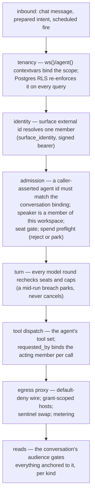
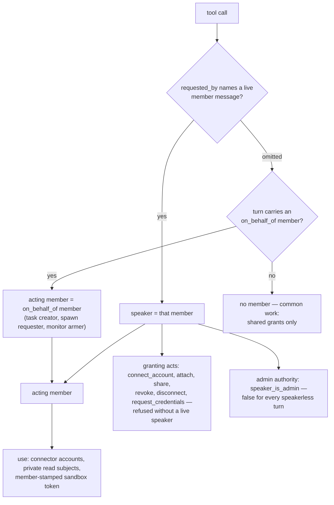
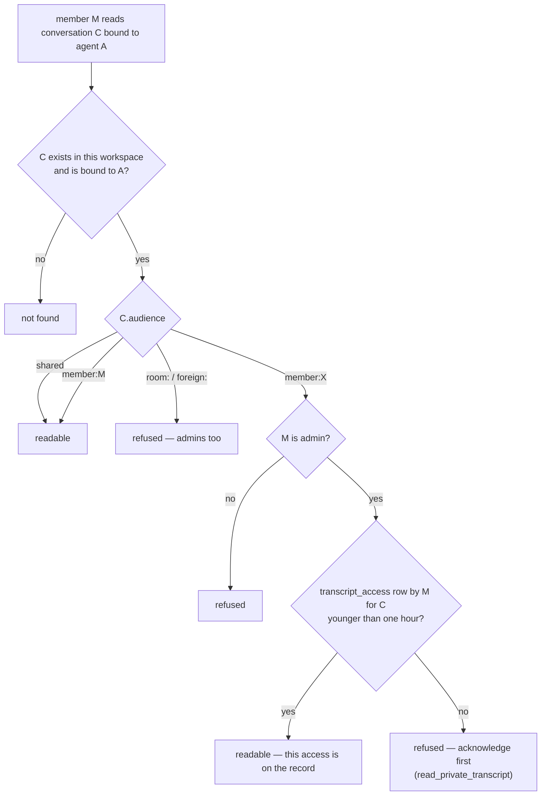
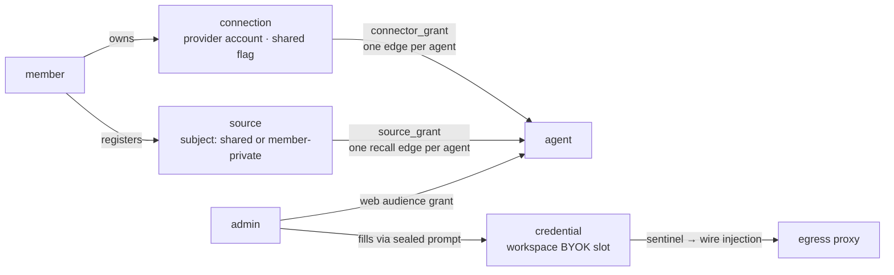
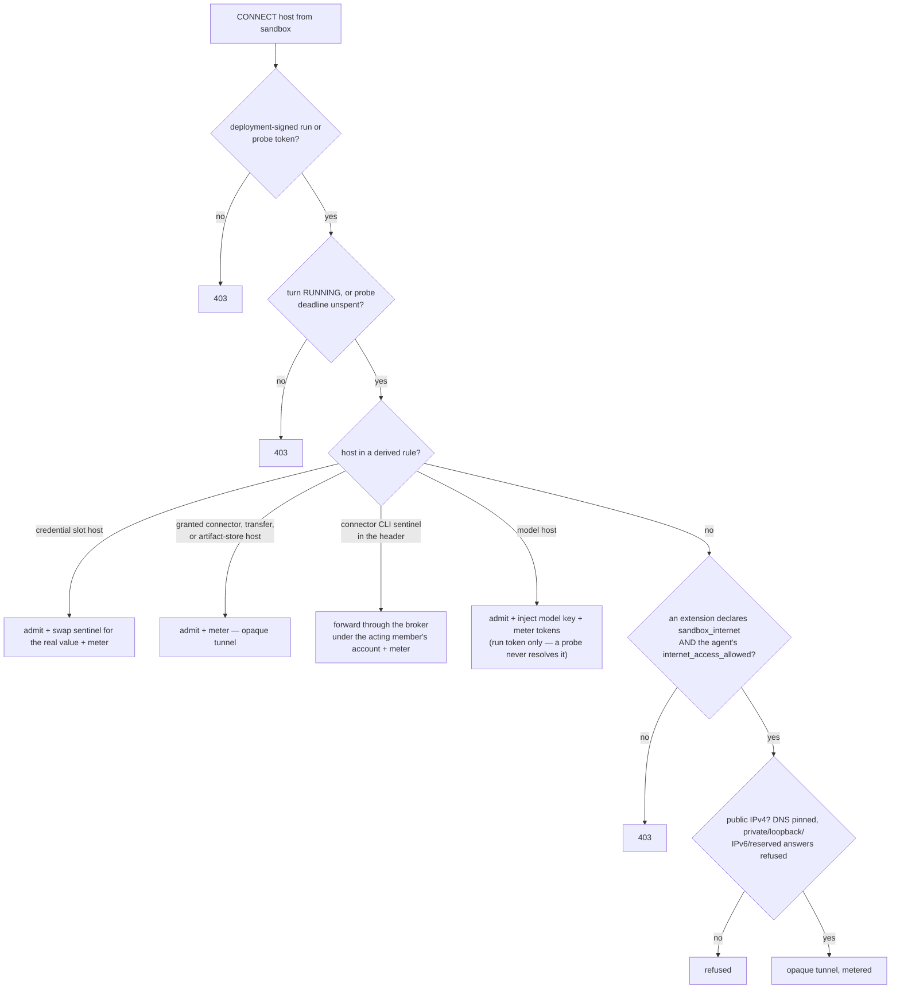

# Permission model

Every action in ufo carries four facts: the **workspace** it belongs to, the **agent** it runs as,
the **member authority** it acts with, and the **audience** that may read what it produces. Each
fact is established once at a trusted boundary and enforced by a different layer. Where two
things that look alike are governed differently, this document says so.

| Layer | Question | Mechanism | Home |
|---|---|---|---|
| Tenancy | which workspace | `ws()` / `agent()` contextvars + Postgres RLS + blob key prefix | `core/src/ufo/workspace.py`, `db.py`, `blob.py`, `control/src/rls.rs` |
| Identity | which human | `surface_identity` row + HMAC bearer (`ufo_session` cookie / CLI token) | `core/src/ufo/ext/surface.py`, `core/src/ufo/bearer.py` |
| Admission | may this turn start | membership, agent-binding assertion, seat gate, spend preflight | `core/src/ufo/surfaces/admission.py`, `core/src/ufo/seats.py` |
| Authority | who does this act speak for | `speaker_member_id` per message, `on_behalf_of_member_id` for background work, `requested_by` per tool call | `core/src/ufo/loop/engine.py`, `tools/context.py` |
| Grants | which external capability | `connector_grant`, `source_grant`, `credential`, web-audience grant, agent tool set | `core/src/ufo/grants.py`, `credentials.py` |
| Wire | what leaves the sandbox | egress proxy rules derived from manifests and grants, keyed by a signed run token | `core/src/ufo/sandbox/proxy/` |
| Reads | who may see it | the conversation `Audience` atom, per-kind gates | `core/src/ufo/audience.py`, `objects.py` |

## Principals

| Principal | Identity carrier | Reach |
|---|---|---|
| Seated member | `surface_identity → member`, bound to `turn.speaker_member_id` at admission | chat, prepared intents, own objects, own + shared conversations, roster read |
| Unseated member | same row, `seated_at IS NULL` | no turns: refused at admission, parked mid-run; signed-in portal reads remain, and the row persists as identity and memory subject (`member` refuses delete) |
| Admin | `member.is_admin`, read live per call | management verbs — content beyond their own audience only through a recorded disclosure, except the artifacts listing (see [Read paths](#read-paths-and-how-they-differ)) |
| Main agent | `agent.is_main` | member/agent kind writes, cross-agent object verbs, workspace roster, the source-owner exception |
| Child agent | its `agent` row | its own grants and conversations; in chat it may edit no agent, not even itself (an admin's intent lane may edit it) |
| Scheduled fire / subagent | no speaker; `on_behalf_of_member_id` (task creator / spawn requester / monitor armer / the member a first-party job names — an agent's owner, else the workspace's earliest-seated admin) | that member's *use* capabilities — never granting acts, never admin |
| Extension | `ExtensionContext`, scoped at construction | its declared slots, its own store, the ambient workspace — never a blob handle, never another workspace; its raw DB transaction is bound by RLS |
| Operator | local process access for `ufoctl`; `OPERATOR_EMAIL_DOMAIN` bearer for the debug/memory surfaces | fleet-wide, outside the member model |

### Speaker, acting member, admin — three distinct authorities

The engine builds each turn's tool context with **no speaker**. A tool call names the member it
acts for via `requested_by` — a message ref the model copies from a visible, absorbed member
inbound — and the engine re-binds the call's context and sandbox run token to that member
(`_bind_requester`, `core/src/ufo/loop/engine.py`). Omission means common work, except a turn
carrying a durable `on_behalf_of` member — a scheduled fire, a subagent, a monitor's arrival —
retains it.

The asymmetry is the doctrine: **granting gates on the live speaker; use gates on the acting
member.** A scheduled run may *use* its creator's private connection but can never connect,
share, revoke, or fill a credential — each granting verb gates on the live speaker, the kinds
that disclose or revoke access declare speaker-required mutation on the shared object base
(`core/src/ufo/objects.py`), and `speaker_is_admin` is false whenever `speaker_member_id` is None
(`core/src/ufo/tools/context.py`), so background work can never exercise admin authority either.

## Tenancy

`with ws(workspace_id)` binds a contextvar every scoped capability reads; `with agent(agent_id)`
requires a bound workspace, refuses an in-place switch, and re-checks the pair on every read
(`core/src/ufo/workspace.py`, `agent_scope.py`). Every trusted boundary binds scope from its own
durable record or signed claims: turn workflows from the queue row, surface requests from the
verified session, OAuth callbacks from Fernet-sealed state, the egress proxy from run-token
claims, jobs from their candidate row.

Row-level security backs the contextvar on Postgres:

- The control plane (`ufo-control rls-bootstrap`, `control/src/rls.rs`) enables
  RLS and creates a `workspace_id = current_setting('app.workspace_id')::uuid` policy on **every**
  table in `public` (`alembic_version` aside); a table with neither `workspace_id` nor
  `id`-as-workspace fails the bootstrap. Policies are runtime DDL, not alembic migrations — a new
  table is policed at the next bootstrap.
- The app connects as `ufo_serve`, the RLS subject. `workspace_tx()` pins the GUC with
  `SET LOCAL`, so a pooled connection carries nothing across checkouts, and a transaction that
  never bound a workspace errors instead of leaking (`core/src/ufo/db.py`).
- `ufo_owner` owns the tables and bypasses policy. `owner_tx()` is the deliberate bypass: its
  contract is identifiers only, each re-bound under `ws(...)` before any data read (job
  candidates, writeback fan-out, CLI verbs); workspace-less fleet rows (`runtime_instance`) are
  its one write surface.

Where the layers differ:

| Context | Tenancy enforcement |
|---|---|
| Postgres, serve role | RLS policy on every query, fail-closed on an unbound transaction |
| SQLite | no RLS and no stand-in mechanism — isolation rests on the callers' own scoping (workspace predicates, UUID-keyed rows) plus the scoped blob and credential layers; single-instance only |
| Egress proxy, sandbox ingress | connect with the **owner** role (one shared proxy serves every tenant) and scope every query by the token's `workspace_id` by hand |
| Blob store | `WorkspaceBlobStore` prepends `workspaces/<id>/` from ambient scope and refuses pre-prefixed keys; `FleetBlobStore` accepts only `static/` and `term/` |
| Extensions | import gate plus RLS (see [Extension seam](#extension-seam)) |

## Identity and admission

One member is one human across surfaces. Each surface authenticates its own way and lands on the
same `surface_identity → member` row:

| Surface | External id | Authentication |
|---|---|---|
| Slack | Slack user id | workspace-selected signing secret verifies the original request bytes; Slack-confirmed same-domain email may join as a new member |
| Web portal | email | `ufo_session` cookie (HMAC bearer), entered by one POST from the gateway's signed-in card — never a URL bearer |
| Terminal / CLI | email | long-lived CLI token from `ufoctl init` or the hosted gateway, sent as a bearer |
| Hosted sites | email | same session cookie; the site's own visibility rule gates the render |
| Debug / memory explorer | operator bearer | email domain must equal `OPERATOR_EMAIL_DOMAIN`; `?ws=` re-scopes to any workspace |

Admission (`core/src/ufo/surfaces/admission.py`) then holds four gates:

- A caller-supplied agent id is an assertion: the conversation is permanently bound to one agent
  at creation, and a mismatch is refused. Surfaces cannot admit as an agent of their choosing —
  `MemberAdmission` hard-codes the assertion away; jobs and extensions get the separate `invoke`
  capability whose turns can never claim a member spoke.
- The speaker must be a member of the bound workspace; a member admission whose speaker never
  resolved is cancelled outright.
- The seat gate: `seated_at` is set by the member row's own column default (no creation path can
  mint a member the agent refuses) and cleared only by an admin's revoke. The gate member is the
  turn's speaker, else its on-behalf member, whatever admitted it. It is checked
  at admission, when a message folds into a live turn, and again **every model round** — a
  revoke parks running turns. Three invariants protect the last admin: the last seated admin
  cannot be unseated, the last admin cannot be demoted, and a demotion may not leave zero seated
  admins.
- Spend preflight (see [Spend caps](#spend-caps)). A refusal — seat or cap — parks instead of
  cancelling when the turn holds already-paid work (a delivered subagent result).

**Prepared intents** are the portal's one mutation path: a panel form's structured intent is
admitted as a turn on the member's durable intent conversation (`intent/<agent>/<email>`,
member-private audience) and dispatched verbatim — no model round, no fold into a live turn — so
the turn is the audit record and the kind's own gate produces the result or refusal. The verb and
kind sets are closed (`extensions/web/ufo_ext_web/panels.py`). Two intent-lane properties differ
from chat: the agent **tool allowlist does not apply** — there is no model round to misuse a
tool, and the panel's verb runs under the submitting member's authority, which is what lets an
allowlisted shipped agent still be granted an account (the lane still serves only the
member-facing set; `profile_only` stays withheld) — and an admin may change any agent setting
through the lane while chat admits only the main agent changing a prompt.

## Audience — who may read

A conversation's persisted `Audience` atom is set at creation, narrows as its surface learns
more, and is carried unchanged into every turn (`core/src/ufo/audience.py`):

| Atom | Assigned to | Content readable by |
|---|---|---|
| `shared` | Slack public channels; extension-opened conversations (triggers, errands) that name no member | every member |
| `member:<uuid>` | Slack DMs, terminal sessions, web chats, intent lanes; an extension-opened room that names a member — the shape an on-behalf job's turn runs in | that member |
| `room:<surface>:<room>` | Slack private channels and MPIMs | **nobody** — no read path answers from room membership |
| `foreign:<surface>:<room>` | Slack Connect / externally shared channels | **nobody**, and sealed: it can recall nothing internal |

A new Slack conversation whose kind cannot be decided is refused (503), never guessed. The
audience only narrows (`narrow_audience`): `shared` may become anything, a room may seal to
`foreign` on the same key (never back), a widening request is ignored, and any other change
raises. Subagent conversations inherit the spawning turn's audience verbatim.

Room membership is read at send and never served. To map an `@name` onto the id Slack notifies,
the Slack surface reads that channel's own roster (`conversations.members`, first 100, members of
the installed team alone — a Connect guest is never mapped) and pins the resulting name-to-id map
in the reply's delivery record, so every retry splits the same text. No member-facing read answers
from that map.

`readable_audiences(member)` is the one definition every member-facing content read answers from:
`(shared, member:<me>)` — no admin arm. The admin path exists but is separate, audited, and
narrow:

The acknowledgement is itself a granting act — `read_private_transcript`, an admin-only chat
verb the portal dispatches through the prepared-intent lane: the row names reader, subject, and moment before any
content is served, emits `surface.transcript_disclosed`, opens that one conversation to that one
admin for an hour, and is read back only by `ufoctl transcript-reads` — no member-facing route
lists it. Chat stays narrower on purpose: no tool reads another member's transcript, because an
agent's context summarizes, embeds, and recalls — one bounded disclosure would become an
unbounded one.

### Read paths and how they differ

The audience atom is one rule; what each projection does with an admin differs by what it serves:

| Read | Non-admin | Admin |
|---|---|---|
| Conversation content (transcript, bubbles, slots) | `readable_audiences` | + disclosure path above; rooms/foreign never |
| Conversation rail | readable rows only; participation splits mine/others, never widens | same — the rail always reads as the member |
| Per-agent conversations view | readable rows only | every row, but title/speakers/source are blanked on unreadable rows (label and owner email remain) |
| Conversation search | label, owner, title, and speaker match over listable rows | title/speaker-words match only inside readable rows — search cannot probe a private thread without the audit |
| Artifacts, portal listing | files of readable conversations | **every conversation's files, rooms and foreign included, no disclosure record** — the one read where private content reaches an admin unaudited; the `shared` scope toggle re-applies reader audiences even for admins |
| Artifacts, `artifact` object kind | `audience_subjects` of own audience | same — the `admin` flag is accepted and ignored |
| Radar / scheduled-runs feed | `readable_audiences`, unconditional | same — the projection takes no admin parameter |
| Agent homepage, portal Home tab | the agent's own `visibility`: `workspace` → every member, `private` → the agent's owner | + private-agent homepages — admins reach every agent, so the frame admits them and the read hands out the link |
| Memory (portal + `memory` kind) | `{shared, member:<me>}` | same — admin ignored |
| Usage | own window, no other member or agent named | + workspace rollup |
| Roster, portal team view | full roster to every signed-in member | same |
| Roster, `member` kind in chat | full roster on the main agent in internal conversations; own row alone off a child agent or in a foreign channel; none on a speakerless turn | same |

Memory reads deserve their own row of differences, because the subject set depends on **how** the
question is asked (`audience_subjects`, `ToolContext.read_subjects`):

| Path | Subjects |
|---|---|
| Automatic recall (per-turn hook) | the conversation audience's subjects only — no acting member, so room/shared recall can never inject a member's private memory |
| Explicit `memory_search` / opened result objects | conversation subjects **plus** the acting member's own subject — never the shared atom their private audience would also read |
| Memory writes | a workspace-shared conversation writes to the requester's private subject; a room or foreign conversation is its own memory space and writes stay keyed to it |
| Foreign (`foreign:*`) anywhere | never reads `shared`; automatic recall reads only the sealed subject itself |

Sites are the outlier by design: a hosted site carries its own `visibility` column —
`private` (creator and workspace admins), `workspace` (any signed-in member), `public` (anyone
with the link) — taken from the deploying member's request, defaulted from the conversation
audience when unnamed (member or foreign audience → `private`, else `workspace`), and managed
thereafter by its creator; an admin may only narrow to private. An agent's homepage is a pointer
to one such site, and while bound the site's own column lies dormant: the frame, the read, and
the `site` kind's listing all answer the agent's `visibility` instead — `workspace` admits every
member, `private` the agent's owner and admins — so flipping the agent object is what moves the
page. The bind itself is the re-gating act, so `set_homepage` gates like a visibility change:
only the site's creator acting may bind it — another member's site would widen or narrow out
from under its creator — and a standing site needs a live speaker, a speakerless turn reaching
only the site its own turn deployed, which is the seed's deploy-and-bind shape.

## Grants — what an agent may use

Capabilities accumulate through grants made in chat, never borrowed from caller identity.

**Connections and connector grants.** A `connection` is one member-owned broker account per
`(workspace, provider, account)`; it holds no secret — the broker holds the provider token and
executes server-side, so brokered auth is auth **by proxy** and derives no injection rule.
`connect_account` requires a speaking member, and reconnecting an account another member owns is
refused, never reassigned. The `connector_grant` edge attaches the connection to one agent and
cascades away with it. A held connection reaches another agent without a new OAuth handoff: the
**main agent** applies the `connector_grant` kind with an `agent:` target — only on a live
member-requested call, and only when that speaker owns the connection or it is shared — creating
just the edge. The portal's Attach connection control is the same act on the target agent's own
intent lane.

At use time, account resolution admits the **acting member's private attachments plus shared
connections, preferring private wholesale**; two candidates inside the winning tier is a hard
error naming them (the sandbox env export skips instead of guessing). The connector tools and
the sandbox CLI env each derive that tiering independently; the proxy applies the same
own-or-shared rule per grant without tiering — its sentinel already names one account.

**Sources and source grants.** A source is one member-owned, agent-neutral synced dataset. Its
member visibility is its `subject` (`shared` or `member:<uuid>`); its agent
access is the separate `source_grant` edge — sharing with members never grants an agent, and
granting an agent never widens members. Registering a persistent source from a connection is
owner-only, even on a shared connection. One exception exists: the **main agent** may read a
member's own ungranted source while that exact member is the **live speaker** — a scheduled run
or subagent carries its initiator's use authority but never this exception. Sync resolves the
owner's connection independently of agent grants and re-validates it on every HTTP request, so a
disconnect kills in-flight syncs.

**Credentials (BYOK).** Workspace-scoped encrypted slots declared by extension manifests. A
speaking **admin** fills one through the sealed `request_credentials` handoff — the value crosses
only in the prompt's private fulfillment, entering no transcript, intent, or sandbox. No read
path returns a value: the `credential` kind answers `filled: true|false`, its apply always
refuses, delete (clear) is admin-only. Every member reads the slot index and its fill state — a
declaration carries no member scope, and no read discloses a value. The portal's set/replace
prepares that same sealed prompt.
Operators fill slots with `ufoctl credential set`, limited to the same member-fillable subset.

**Web audience.** Which agents a member reaches in the portal starts from the agent's own
`visibility` (agent-kind spec field): every member reaches every `workspace` agent — main is born
one and refuses to narrow. A `private` agent reaches its owner, and beyond that the web
extension's own grant store: `grant_web_access`/`revoke_web_access` (admin-only, in chat, or the
admin view's intent lane) govern per-member access; admins reach every agent. An out-of-audience
agent is not-found on every portal route.

Sharing semantics differ by object:

| Axis | Connection | Source |
|---|---|---|
| Sharing lives in | `shared` boolean on the connection | `subject` string on the source |
| Widening | monotonic on reconnect; explicit act otherwise | one-way flip to `shared`, restamps live pages |
| What sharing means | any member may **use** the account through any granted agent | any member may **see** the dataset in recall — agents still need their own edge |
| Admin may | unshare, revoke, disconnect — never share or attach another member's private connection | inspect, resync, delete — never edit; narrowing to private is refused for everyone |
| Chat visibility (`connection` kind) | owner or admin only, even when shared | its own gate: shared, owned, or admin |
| Portal visibility | a shared connection names its owner to every member who can use it | same rule via source listing |

Revocation cascades:

| Act | Effect |
|---|---|
| Revoke one grant | that agent's edge only; connection and other edges survive |
| Disconnect a connection | one transaction: source grants deleted, sources stopped and tombstoned, grant edges cascade, connection row deleted |
| Unshare | flips every attached agent's use back to owner-only at once |
| Remove a source | `removed_at` stamped, every `source_grant` deleted, live pages tombstoned |
| Revoke a seat | admission refuses and running turns park; grants and rows persist |

Revocation does not wait for turn end: the connector tools re-read grants per call, and every
CONNECT reads turn liveness and the workspace's egress-rules generation fresh — a counter
database triggers bump on every connection, grant, and credential write — so the proxy's cached
rule derivation is re-derived at the next CONNECT after any of them changes.

## Wire enforcement — sandbox and egress

Every turn's tools run in a sandbox whose only route out is the egress proxy. Rules are
**derived** from manifests and grants — an extension declares a connector, credential slot, or
`sandbox_internet`, never a raw network rule.

- **Sentinel swap.** Processes inside the sandbox hold placeholder strings; the proxy swaps the
  real value onto the wire on an exact sentinel match. This is only for declared credential
  slots — member-filled or deploy-minted (the GitHub App's installation token) — and the
  deployment model key. A brokered connection injects nothing, because the token never exists on
  this deploy: a connector that declares a CLI credential exports its sentinel, and a request
  carrying it forwards through the broker under the acting member's account; every other granted
  host is an opaque tunnel, admitted and metered, never terminated.
- **Tokens.** Each tool command carries a deployment-signed run token naming its turn and acting
  member; every CONNECT requires the named turn to still be running. A probe token (the off-turn
  exec a jobs-role handler runs) names a conversation and the member whose work armed it, expires
  on its own deadline, and **never** resolves the model key.
- **Public internet** requires two independent grants: a manifest-level `sandbox_internet`
  declaration by an active extension, and the agent row's `internet_access_allowed` (an admin
  narrows it per agent; the proxy snapshots it per turn).
- **Metering.** Admitted hosts are metered — a tunnelled host per CONNECT, a terminated one per
  request. Egress rows are counts (priced zero); model calls made from inside the sandbox are
  token-billed at real prices.

Carriers differ in what they actually enforce — the proxy's guarantees only bind clients that
cannot route around it:

| Carrier | Isolation | Sandbox env | Egress posture |
|---|---|---|---|
| `docker` / `e2b` (extensions) | container / provider VM; per-conversation network | built from scratch | default-deny is real: the proxy is the only route |
| `local` (core default) | **none** — only tool *arguments* are workspace-guarded (lexical path check); a raw shell reaches the host | built from an allowlist: scratch HOME and PATH, locale and tmp passthrough, proxy and sentinel exports | proxy honored by convention only; the model-key sentinel still fails closed |
| `client` (connected terminal) | none by design — the agent acts as the member, in their `$PWD`, as their subprocesses; ops travel the member's own held stream and only the binding's member may answer | the member's own shell env plus an overlay | cooperative metering; with no public proxy URL it points at loopback and proxy-honoring commands fail closed; the model sentinel is never exported |

The local carrier is the development / trusted-input default; Docker or E2B is the answer for
untrusted input or multi-tenant deploys.

## Tool availability

- `agent.tools` null → every registered tool except `profile_only` ones; a tuple → strict
  allowlist intersected with the live registry. `profile_only` tools reach only a subagent
  profile or extension-shipped agent whose declared allowlist names them — an allowlist is
  declared in a manifest, never typed by a member, so no member can grant a held-back primitive.
- A prepared intent bypasses the allowlist (§Identity and admission).
- A subagent's set is its profile's tools ∪ every `subagent_default` tool ∪ cross-extension
  `subagent_tool_grants` (union-only); an isolated profile keeps its own list alone. Only core
  constructs the child registry.
- Skills are not tool-gated: `load_skill` resolves against the deploy registry; member-authored
  skills join only their bound agent's registry.
- Hooks are a policy **filter** over what grants already admit — a gating hook may deny or
  modify, never admit; a hook that raises or times out fails closed to a deny.

## Spend caps

`spend_cap` rows scope to `workspace`, `member`, or `agent`, each with a rolling window and
`reject` or `park` on breach. Every applicable cap must have headroom — the tightest binds — and
a workspace balance under its operator-set reserve parks outright, at every moment alike, until
a credit lands. Where the cap answer differs by moment:

| Moment | Breach behavior |
|---|---|
| Admission | `reject` cancels with a terminal frame; `park` holds the turn — and a turn carrying already-paid work (a delivered subagent result) parks even under a reject cap |
| Before every model round | always parks — reject is the inbound gate; a running turn has real spend to preserve |
| Dispatcher sweep | a parked turn re-enqueues only when every gate member is seated and the decision is allow again |

## Extension seam

Extensions import only `ufo.sdk` — a CI gate (`gates.py`) fails any other `ufo` import under
`extensions/` and `packs/`. A handler receives a capability-scoped `ExtensionContext`: a store
keyed to `(extension, ambient workspace)`, credential access limited to declared slots, the
turn's audience, bounded trajectory reads, conversation-scoped file writes — never a raw DB or
blob handle, never another workspace. `transaction()` yields a real connection over the
extension's own tables; its runtime tenant boundary is RLS, not the SDK. Off-turn probes exist
only in jobs-role contexts, structurally absent elsewhere.

Manifest points are the capability declarations; a few are privileged in kind:

| Point | Why it is trusted |
|---|---|
| `carriers` | implements the sandbox itself: filesystem, exec, egress env |
| `surfaces` | asserts member identity and admits turns |
| `routes` | its `identify` return is bound as the ambient workspace — the extension authenticates its own callers (the SDK's `workspace_claim` is the verified helper) |
| `agents` | ships an agent row whose allowlist may name `profile_only` tools; arrives with no grants — a member grants each in chat |
| `member_context_read` | reads outside any one conversation — the seated roster, the agent roster with owners, the earliest-seated admin, the scheduled member's own cross-agent context, and one on-behalf turn for a seated member; first-party only, since the loader refuses any distribution but `ufo` that declares it |
| backend seams (`indexes`, `embeds`, `hubs`, `carriers`, …) | each becomes the deploy's single implementation, receiving scoped credential access; `models` instead merges every manifest's specs into one registry, one spec per model id |

## Operator

The operator audience is not a member role. `ufoctl` verbs authenticate by local process access
to the config and database (spend caps, balances, credentials, extension installs, turn cancel,
`transcript-reads`). The debug and memory-explorer web surfaces (identity table above) bind the
operator-picked workspace and read it whole: the debugger reads its conversations, transcripts,
and workspace files with no audience filter, the memory explorer every memory item, shared and
per-member. RLS scopes each read to the one bound workspace.

## Proofs

| Invariant | Proof |
|---|---|
| RLS isolation, fail-closed GUC, owner bypass | `control/tests/rls_it.rs` (the `control` CI job) |
| Pooled connections carry no workspace across checkouts | `core/tests/test_db.py` |
| Blob prefix scoping and fleet-store bounds | `core/tests/test_blob.py` |
| Audience atoms, narrowing, subject sets | `core/tests/test_audience.py` |
| SDK import boundary, raw-engine and raw-blob bans | `gates.py`, `core/tests/test_gates.py` |
| Extension cannot escape its scope (credentials, store, files, probes, model key) | `core/tests/test_ext_conformance.py`, `core/tests/test_ext_context.py` |
| Seat gates (admission, fold, per round), last-admin invariants | `core/tests/test_admission.py`, `core/tests/test_engine.py`, `core/tests/test_seats.py`, `core/tests/test_members.py` |
| Grant ownership, sharing, revocation | `core/tests/test_grants.py` |
